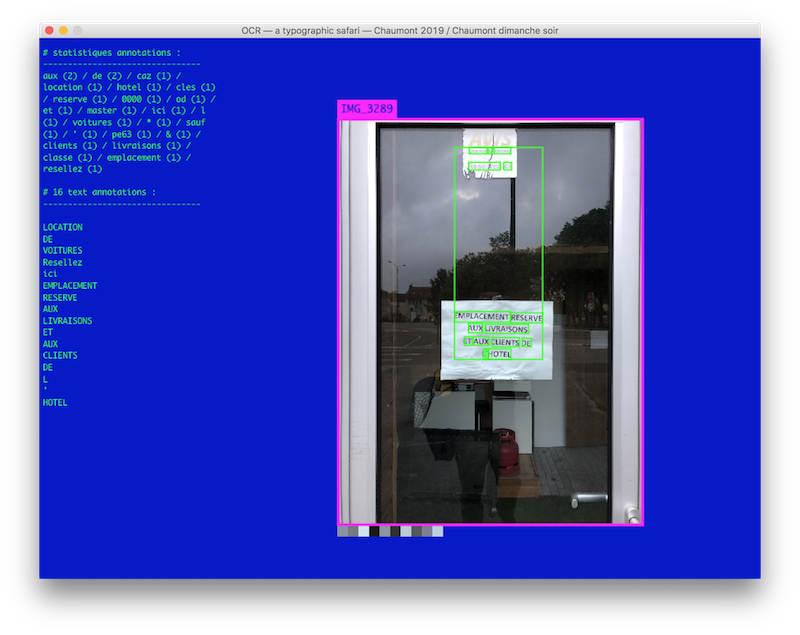

## Tool screenshots

## Box 1bis and 1 @ Tezla Texil
[Box1bis](Visuels/box 1 bis b.jpg)
[Box1bis](Visuels/box 1a.jpg)
[Box1bis](Visuels/box 1b.jpg)

## Links
* [Reconnaissance optique de caractères](https://fr.wikipedia.org/wiki/Reconnaissance_optique_de_caract%C3%A8res) / [Optical character recognition](https://en.wikipedia.org/wiki/Optical_character_recognition)
* [Google Vision AI](https://cloud.google.com/vision/) which will allow us to retrieve data from images.
* A bit of history, [Yann Lecun showing handwritten digits classification (1993)](https://www.youtube.com/watch?v=FwFduRA_L6Q)
* [Generative gestaltung code packages](http://www.generative-gestaltung.de/1/code), check the 01_P/P_3 sketches for transforming texts into graphic patterns.
* [Languages as symbols](https://writing-system.tumblr.com/)

