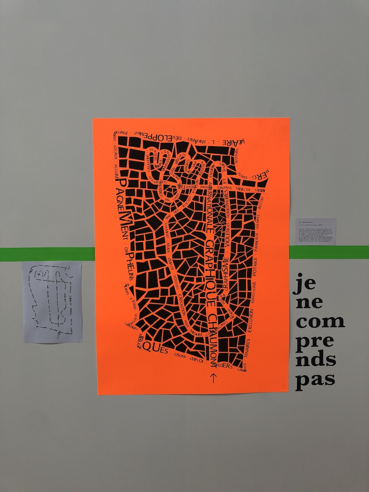

## Tool screenshots

## Zoning

#### Purple area
Pauline, Camille, Aniello
#### Blue area
Maria, Anastasia, Ana, Sergio
#### Yellow area
Chloé, Laetitia, Marine

## Box 1bis and 1 @ Tisza Texil

## Links
* [Reconnaissance optique de caractères](https://fr.wikipedia.org/wiki/Reconnaissance_optique_de_caract%C3%A8res) / [Optical character recognition](https://en.wikipedia.org/wiki/Optical_character_recognition)
* [Google Vision AI](https://cloud.google.com/vision/) which will allow us to retrieve data from images.
* A bit of history, [Yann Lecun showing handwritten digits classification (1993)](https://www.youtube.com/watch?v=FwFduRA_L6Q)
* [Generative gestaltung code packages](http://www.generative-gestaltung.de/1/code), check the 01_P/P_3 sketches for transforming texts into graphic patterns.
* [Languages as symbols](https://writing-system.tumblr.com/)
* [Oulipo](https://en.wikipedia.org/wiki/Oulipo)
* [A Hundred Thousand Poems / Raymond Queneau](https://en.wikipedia.org/wiki/Hundred_Thousand_Billion_Poems)

## Photos

